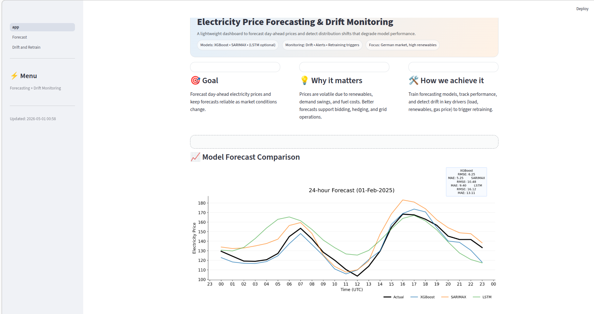

# 📊 Time Series Forecasting Dashboard (Capstone Project)

## 🚀 Overview

This project focuses on forecasting time series data using multiple models and presenting the results through an interactive Streamlit dashboard.

The goal is to compare different approaches and provide an intuitive interface for exploring predictions.

---

## 🧠 Models Used

* **LSTM** (Deep Learning)
* **SARIMAX** (Statistical Model)
* **XGBoost** (Machine Learning)

---

## 📈 Results

Model performance is compared visually using a combined plot generated from all models.

---

## 🖥️ Streamlit Dashboard

Run the dashboard locally:

```bash
streamlit run app.py
```

---

## 🔄 Reproduce Results

To regenerate model comparison plots:

```bash
python scripts/all_models_comparison.py
```

---

## ⚙️ Setup Instructions

```bash
git clone https://github.com/saadsiddiquemughal-svg/DS_capstone_project.git
cd DS_capstone_project

python -m venv .venv
source .venv/bin/activate   # On Linux/Mac
# venv\Scripts\activate     # On Windows

pip install -r requirements.txt
```

---

## 📁 Project Structure

```text
.
├── app.py
├── artifacts/
├── scripts/
├── src/
├── pages/
├── notebooks/
├── assets/
├── requirements.txt
└── README.md
```

---

## 📸 Dashboard Preview



---

## 💡 Future Improvements

* Deploy dashboard online
* Add more models
* Improve UI/UX

---

