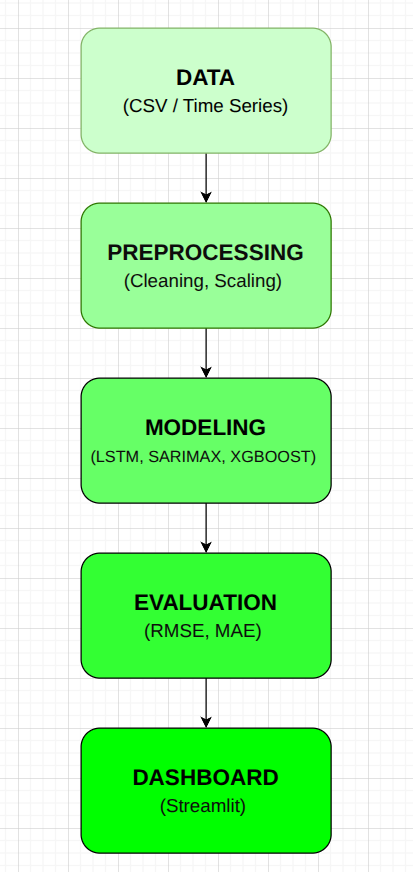
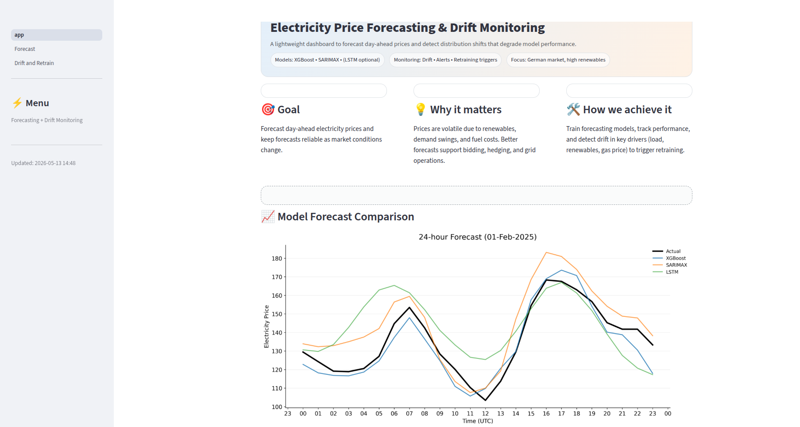
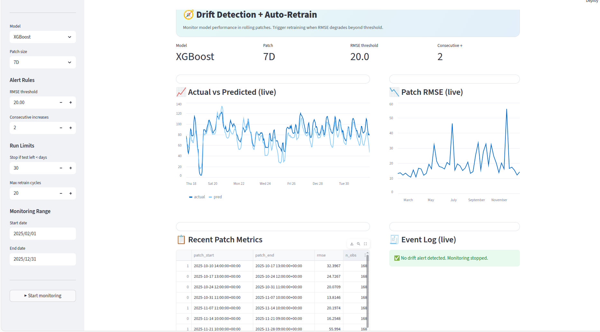

# Time Series Forecasting Dashboard

## Overview
Production-style forecasting platform for analyzing and predicting time series data using classical statistical models and deep learning approaches. The project integrates automated preprocessing, model training, evaluation, and interactive Streamlit-based visualization.

---
## Live Demo

[Open Streamlit App](https://time-series-forecasting-dashboard-miwm3q4dp9cgtuzl9k7lqd.streamlit.app/)
## System Architecture



---

## Features
- Time series preprocessing pipeline
- Forecasting with SARIMAX, XGBoost, and LSTM
- Interactive Streamlit dashboard
- Model performance comparison
- Visualization of historical and predicted trends
- Modular project structure

---

## Tech Stack
- Python
- Pandas
- NumPy
- Scikit-learn
- XGBoost
- TensorFlow/Keras
- Streamlit
- Matplotlib / Plotly

---

## Project Structure
```bash
.
├── artifacts/
├── assets/
├── data/
├── notebook/
├── pages/
├── scripts/
├── src/
├── app.py
├── requirements.txt
└── README.md
```

## Models Used
- SARIMAX
- XGBoost
- LSTM

---

## Model Performance

| Model | RMSE | MAE |
|---|---|---|
| LSTM  | 16.12 | 13.11 |
| SARIMAX | 10.48 | 9.4 |
| XGBoost | 6.25 | 5.25 |


---

## Dashboard Preview

### Main Dashboard


### Forecast Visualization


### Drift Detection and Auto-Retraining 

---

## Installation

```bash
git clone https://github.com/saadsiddiquemughal-svg/time-series-forecasting-dashboard.git

cd time-series-forecasting-dashboard

python -m venv venv

source venv/bin/activate   # Linux/Mac
# venv\Scripts\activate    # Windows

pip install -r requirements.txt

streamlit run app.py
```

---

## Future Improvements
- Docker containerization
- Cloud deployment 
- Real-time streaming data integration
- Multi-user dashboard support